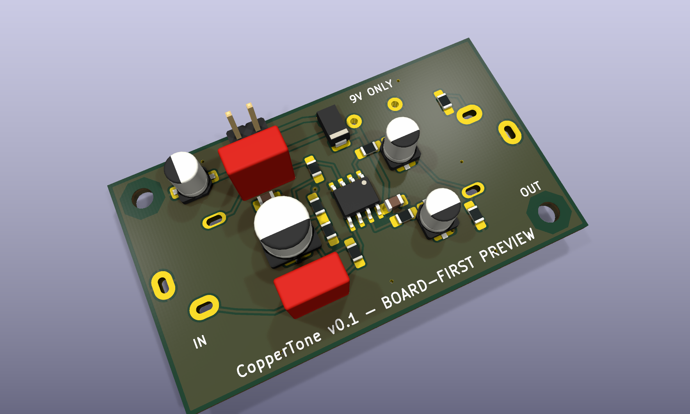

# CopperMCP

[](https://github.com/seunghyukchoe/copper-mcp/actions/workflows/ci.yml)
[](https://github.com/seunghyukchoe/copper-mcp/actions/workflows/codeql.yml)
[](https://github.com/seunghyukchoe/copper-mcp/releases/latest)
[](LICENSE)
[](pyproject.toml)
[](docs/roadmap.md)

**CopperMCP is a local-first, open-source PCB automation platform designed for deterministic routing,
MCP-based tools, and optional AI policy plugins.**

It lets an AI client read a KiCad board as typed, exact-integer geometry, propose routes and
placements, and validate them against authoritative KiCad DRC — without ever letting the model
write copper. Every generated result is an immutable candidate bound to an exact board revision
until a human explicitly applies it.

> [!IMPORTANT]
> CopperMCP is an **MVP-alpha** — `server_info` reports `maturity: "mvp"`, and the version badge
> above is the authoritative released line. Exactly two operations write to a board file,
> `apply_candidate` and `apply_placement_candidate`; both are off by default behind an operator
> environment flag plus an operation-scoped single-use token that no model can mint. Everything
> else reads. Read [What CopperMCP does not claim](#what-coppermcp-does-not-claim) before relying
> on any result.

## Why this project exists

Existing open autorouters provide useful geometry and negotiated-congestion baselines, but there is
no broadly adopted open platform that combines reproducible routing, safe agent tools, learned
policy hooks, KiCad-native workflows, and transparent benchmarks. CopperMCP is building that layer
without putting an LLM in charge of electrical correctness.

The non-negotiable boundary is simple:

- AI may interpret constraints and propose net ordering, corridors, cost weights, and repairs.
- Deterministic code owns geometry, connectivity, DRC, provenance, and file mutation.
- Generated work remains an immutable candidate until a user validates and explicitly applies it.

## Quick start

Prerequisites: Python 3.11 or newer.

```bash
python3 -m venv .venv
source .venv/bin/activate
python -m pip install -e ".[dev,security]"
make check
```

Inspect a board without modifying it:

```bash
copper-mcp --workspace /absolute/path/to/boards inspect example.kicad_pcb
```

Start the local MCP server over standard input/output:

```bash
export COPPER_MCP_WORKSPACE=/absolute/path/to/boards
copper-mcp-server
```

Example MCP client configuration:

```json
{
  "mcpServers": {
    "copper-mcp": {
      "command": "copper-mcp-server",
      "env": {
        "COPPER_MCP_WORKSPACE": "/absolute/path/to/boards",
        "COPPER_MCP_TRANSPORT": "stdio"
      }
    }
  }
}
```

Never place provider keys or proprietary board contents in committed MCP configuration. See
[`.env.example`](.env.example) and the [security policy](SECURITY.md).

**The [usage guide](docs/usage.md) covers every command and MCP tool** — DRC, scene observation,
deterministic renders, route and placement previews, schematic building, both apply operations, and
the read-only live KiCad IPC observer — with the limits each one declares.

## What it can do today

Each capability below is bound to tests and, where it touches KiCad, to recorded evidence.

**Read a board.** Bounded, read-only inspection of documented `.kicad_pcb` files under workspace
confinement, including protection against parent-path and symlink escapes. SHA-256 board revisions
and versioned JSON schemas throughout.

**Represent a board exactly.** Immutable Board IR `0.3.0` with exact integer units, typed
constraints, canonical digests, first-class footprint pose/side/lock/pad ownership, simple closed
octilinear courtyard rings and exact-integer-radius courtyard circles held **per courtyard layer**
— a footprint may draw on the layer opposite its own side, and that geometry keeps out on the layer
it is drawn on ([ADR-0097](docs/adr/0097-courtyard-layer-decides-the-side.md)) — and a bounded
fail-closed converter for a documented KiCad subset. The 0.1 schema
remains available as immutable compatibility evidence; [migration](docs/migrations/board-ir-0.2.md)
re-converts the original board rather than inventing parents.

**Observe a board semantically.** Circuit Scene IR `0.3.0` over MCP and the CLI. A mandatory region
returns full-precision integer geometry for overlapping objects, split into `static` (outline,
footprints, pads, keepouts, rules) and `mutable` (segments, arcs, vias, zones) so code meaning to
read only the givens cannot iterate over both. Objects are named by the Board IR references they
already carry, each declaring how durable that reference is. Every array a scene returns is
**complete** for the region: a kind that does not fit a ceiling is replaced by a
`withheld_by_ceiling` observation carrying the ceiling it hit and the number of objects omitted,
so a short list can never be misread as an absent one.
Board text is off by default and, when requested, appears only in a separately typed `annotations`
collection marked untrusted; net names never appear at all.

**Render a board deterministically.** An opt-in SVG of the board's copper, delivered as an ephemeral
MCP capability or written by the CLI to a new workspace path. Two renders of an unchanged board are
byte-identical, and the evidence records every input that changes the bytes.

**Route.** Bounded integer A* candidates on a documented rectangular Board IR subset. A two-pad net
routes as one path; a wider net routes as a deterministic spanning tree over its components. Routing
avoids existing foreign-net pads, segments at any angle, through vias, rectangular and polygon track
keepouts, and conservative solid-zone polygon envelopes under exact integer clearance. The foreign-
copper obstacle model is scoped to a region around the net being routed rather than to the whole
board, and five independent ceilings bound the work — lattice nodes, search expansions, region
obstacles, the routed net's own copper, and exact geometric checks — each with its own typed
refusal, so a budget admission is never reported as a proof. Same-net copper is attachment rather
than a refusal, so a partly routed net completes from what is already there.

**Recognize existing connectivity.** A net already joined by existing copper is identified across any
pad count, through same-net through vias between layers, and — behind the opt-in
`include_fill_authority` flag — through poured zone copper, admitted only when a fresh KiCad refill
on a private disposable copy reproduces the board's cached fill exactly. A stale cache is refused
rather than answered from. A candidate records the obstacle model that produced it: a fill-shaped
candidate carries a `fill_binding`, and a replay handed any other fill — including none — refuses
`fill_evidence_mismatch` rather than verifying a route against a model it was never searched under
([ADR-0103](docs/adr/0103-a-candidate-records-the-model-that-produced-it.md)).

**Validate with real KiCad.** Fixed-argument KiCad CLI DRC with source, time, size, schema, and
stale-context guards. Internal candidate-bound DRC evidence ties an exact replayed candidate to its
Board IR base, original KiCad bytes, private patched board, and complete patched rule/library
context, without writing a candidate file into the source workspace.

**Judge a placement.** A typed placement-intent contract and deterministic legalizer, surfaced as a
non-mutating preview. Seven rule kinds name objects only by scene references and carry exact integer
parameters; the language has no way to state an absolute coordinate or to permit an overlap. A
candidate proves exactly four things: pad overlap, board-outline containment, keepout respect, and —
for Board IR `0.2`'s simple closed octilinear courtyard rings and circles, between shapes drawn on
the **same courtyard layer** — courtyard overlap.

**Build a schematic.** Immutable Circuit Intent IR `0.1.0` for bounded two-pin resistor/capacitor
topology, with a strict codec, canonical content digest, and deterministic in-memory KiCad
`20250114` schematic renderer using original embedded symbols. The shared build service requires two
byte-identical renders.

**Write to a board — the two mutating operations.** `apply_candidate` writes a route patch and
`apply_placement_candidate` writes a footprint pose. Those are the only operations in CopperMCP that
modify a file; everything else above reads. Both are off by default behind the same exact
`COPPER_MCP_ALLOW_APPLY` flag, and over MCP each additionally needs its own single-use token, issued
by that operation's preview and bound to the exact candidate, board revision, and path, verified
against a key that exists only inside the running process. The token domains are separate: a route
token can never authorize a placement write, or the reverse. Neither the flag nor a token can be
produced by a model.

Both share the same write discipline. The change is spliced in so every untouched byte stays
bit-identical, the board digest is compared twice, a timestamped pre-apply copy is written first, and
publication is an atomic replace that is verified afterwards and rolled back if it fails.

Route apply admits additive route patches only. **Placement apply is narrower still**: it replays a
pose only for front-side, orthogonally rotated footprints carrying exactly one native KiCad identity
and unfilled rectangular `fp_rect` courtyard centerlines. A back-side footprint, a side change, a
non-orthogonal angle, a filled or non-rectangular courtyard, an ambiguous identity, or any
unsupported property refuses before a single byte is written.

**Watch a live editor, read-only.** An optional official `kicad-python` IPC observer and KiCad
PCB-editor plugin that report only a live board digest, version compatibility, and bounded object
counts, plus an `observe_live_board_scene` bridge that converts the exact active-editor snapshot
into Circuit Scene `0.3.0` geometry. They never mutate KiCad or expose board text, net names, UUIDs,
or geometry beyond the scene contract. Reaching a running editor is an outbound action, so it is off
by default behind the exact `COPPER_MCP_ALLOW_LIVE_IPC` flag; with it off the live tools stay listed
and refuse, and no IPC socket is read from the environment or opened. The plugin half installs from
KiCad's **Plugin and Content Manager** as `com.github.seunghyukchoe.coppermcp-live-observer`
(KiCad 9.0.1+) — and installing it grants nothing on its own, because the flag above still has to be
set in the environment KiCad was launched from. See
[the plugin README](hardware/kicad-ipc-plugin/README.md) for the two steps the PCM cannot perform
for you.

**Live editor mutation: gated, designed, and not implemented.** `apply_live_candidate` verifies
every precondition for a one-undo-step apply into a running KiCad — a third operator opt-in
(`COPPER_MCP_ALLOW_LIVE_APPLY`, required alongside `COPPER_MCP_ALLOW_LIVE_IPC` and independent of
`COPPER_MCP_ALLOW_APPLY` in both directions), a live-scoped single-use capability bound to the
editor session as well as the board, and a compare-and-swap against the session, the board
serialization, and the converted snapshot — then refuses with `capability_not_implemented`. The
mutation waits for adversarial review, because KiCad's IPC API offers no revision or conditional
write and `kipy` discards the per-item status that would prove a push landed. See
[ADR-0074](docs/adr/0074-live-ipc-one-undo-commit-apply.md).

Plus professional CI, CodeQL, dependency auditing, release automation, issue forms, and
[project ledgers](docs/ledgers/README.md). See the [roadmap](docs/roadmap.md) for what comes next.

## What CopperMCP does not claim

This section is deliberately as prominent as the capability list. In this project every claim is
bound to evidence or listed here as an explicit non-claim, and a value that cannot be verified is
modelled as a one-value literal (`not_run`, `not_modelled`, `inconclusive`) rather than implied.

**Routing.**

- **Nothing has been routed by CopperMCP on a real board that needed it.** Every net on the
  reference board was already routed by its designer. Routing is proven on purpose-built fixtures
  with real KiCad DRC, not yet on a board genuinely requiring new copper. This is the project's
  largest empirical gap.
- Multi-pin nets route as a deterministic spanning tree. **Steiner optimality is not claimed.**
- **`preview_route` routes one net at a time, on one layer, against the snapshot as observed.** Two
  candidates for two different nets are **not** mutually compatible: neither was searched against
  the other's copper, and nothing in either candidate says so. `preview_route_bundle` is the only
  surface that composes nets — two to eight of them, published only when negotiated routing, a
  complete composition replay, and the exact cross-net clearance gate all succeed. Presenting a
  set of independent candidates as a plan is a claim CopperMCP never made.
- A budget refusal is not a proof. `search_budget_exceeded`, `grid_budget_exceeded`,
  `obstacle_budget_exceeded`, `obstacle_check_budget_exceeded` and `net_object_budget_exceeded` all
  mean the work ran out. Only `no_path` is a completed search, and `no_path_in_region` is completed
  only inside a region that is a proper subset of the board.
- Zone fill is **not** trusted as saved, and it is never routing authority by default. Cached fill
  is admitted only behind `include_fill_authority`, and only when a fresh KiCad refill on a private
  disposable copy reproduces it exactly; verified foreign islands then replace that zone's
  conservative envelope on the layer they were proved on, and every unproved zone keeps the
  envelope. A candidate the pour shaped is **not appliable**: `preview_route` withholds the apply
  token for it, because apply runs in a later process holding no fill evidence and could only
  replay under the looser model.
- Routing succeeds only for the documented Board IR and single-layer subset. Anything else returns a
  typed diagnostic rather than a guess.

**Board conversion.**

- **Not every real KiCad board converts to Board IR.** The converter is a documented subset and
  fails closed on everything outside it. Re-measured on the private working corpus on 2026-08-13
  (`B-107`): **13 of the 18 saves in that corpus convert.** Those 18 files hold 17 distinct board
  contents — one pair is byte-identical across two save directories, and that pair is not among the
  boards that moved — so the same result reads as 13 of 17 distinct boards, and neither figure is
  the frozen 12-board set the
  [#116](https://github.com/seunghyukchoe/copper-mcp/issues/116) survey measured. Five saves refuse,
  each with a typed refusal naming one construct, never a partial or repaired board: a custom-shape
  SMD pad on four, which has a derivable envelope and nowhere in a Board IR `Pad` to put it
  ([#153](https://github.com/seunghyukchoe/copper-mcp/issues/153),
  [ADR-0100](docs/adr/0100-custom-pads-have-an-envelope-and-nowhere-to-put-it.md)), and copper text
  on one, which is refused **by decision** and not by omission
  ([#141](https://github.com/seunghyukchoe/copper-mcp/issues/141),
  [ADR-0095](docs/adr/0095-copper-text-has-no-derivable-envelope.md)). The pad-level `property`
  refusal that blocked two of those saves is gone — seven of KiCad's eight `PAD_PROP` fabrication
  tokens now convert, one save converted on it and the other advanced onto the custom pad behind it
  ([ADR-0099](docs/adr/0099-pad-fabrication-properties-and-named-pad-refusals.md)). **A refusal
  names the first blocker in document order and nothing more**: every gap closed since that survey
  advanced the refusal on at least one board instead of converting it, so read a refusal as an
  existential and never as a universal. **No "converts every board" result is claimed at any
  count**, converting is not routing, placing or passing DRC, and the counts above supersede any
  earlier survey figure.
- A refusal is not a verdict on the board. It says the construct is outside the documented subset,
  which is the conservative direction — the converter over-refuses rather than guess at geometry.

**Placement.**

- **There is no placement solver.** Placement is judged, not searched: you propose, CopperMCP rules
  on it.
- A placement preview evaluates **legality**, never quality. A candidate that comes back clean was
  judged legal against the rules it was given — and a preview run with no rules proves only that
  the placement is legal as found. There is no score, no ranking, and no statement that one legal
  placement is better than another.
- Courtyard overlap **is** evaluated, but only between shapes drawn on the same courtyard layer,
  only over simple closed octilinear rings (edges horizontal, vertical, or exact 45-degree chamfers)
  and circles of exact integer radius, and only as overlap — there is **no configurable courtyard
  clearance**. The pairing is by **layer, not by footprint side**: a footprint may draw on the layer
  opposite its own, and that keep-out is compared on the layer it was drawn on
  ([ADR-0097](docs/adr/0097-courtyard-layer-decides-the-side.md)). Arcs, curves, arbitrary slopes,
  fills, and open or branching contours are refused upstream by Board IR rather than judged here.
- Courtyard overlap is **three-valued**, and bound to what KiCad 10.0.5 actually compares rather
  than to raw ring geometry: a footprint's rings form one even-odd region, so a ring nested inside
  another is a **hole** and a donut courtyard's centre is occupiable; and each region is contracted
  by KiCad's 5,000 nm `BuildCourtyardCaches` inset, so a nominal penetration below 10,000 nm is
  reported `inconclusive` rather than rounded either way (ADR-0075, closing
  [#72](https://github.com/seunghyukchoe/copper-mcp/issues/72) and
  [#74](https://github.com/seunghyukchoe/copper-mcp/issues/74)). `proven_clear` is licensed only by
  an outer bound and `violated` only by an inner one; anything neither bracket certifies stays
  `inconclusive`. Do not read `inconclusive` as either answer.
- Pad overlap is deliberately three-valued: `inconclusive` means neither clearance nor collision
  could be proven, not that something is wrong.
- A placement candidate is bound to KiCad DRC evidence only when a preview is asked for it with
  `include_drc`; by default that evidence is absent rather than assumed.

**Apply.**

- Route apply takes route patches only. There is no merge, no lock override, and no batch apply.
- Placement apply replays a pose only for the front-side, orthogonal, single-native-identity,
  unfilled-rectangular-courtyard footprint subset, and refuses everything else before writing.
- The pre-apply copy is **not a KiCad undo step**. Restoring it means copying it back yourself.
- An applied board carries **no DRC evidence**. What is verified is that every untouched byte is
  identical, that the result reparses, and that its Board IR is the original plus the patch.

**Schematics and validation.**

- Schematic builds report KiCad parsing, ERC, and schematic-to-board parity as `not_run`. Electrical
  validation is `not_run` and board readiness is false.
- `verify_circuit_schematic_erc` runs the authoritative `kicad-cli sch erc` on a generated schematic
  and round-trips it through KiCad's netlist export. It reports `passed` (no error-severity
  violation) and `clean` (no findings or ignored checks at all) separately — the passive fixture is
  `passed: true, clean: false`. **ERC-clean is not schematic-to-board parity**, which is a separate
  surface below; KiCad models board parity as a board-side DRC result with no place in an ERC report.
- `verify_source_to_board_parity` runs the authoritative `kicad-cli pcb drc --schematic-parity` and
  reports whether a workspace board implements the intent's connectivity. The board is compared
  against a **board-eligible projection** of the intent, disclosed under its own digest — **a
  `passed` verdict is not a claim that the schematic file you were handed matches the board.** That
  file marks every symbol `on_board no` and never enters KiCad's board-side netlist, so it cannot
  support such a claim. The verdict is refused outright unless KiCad demonstrably accounted for
  every component, because an empty parity result is also what a check that never ran produces.
  **Parity is not ERC, footprint correctness, electrical validation, or board readiness**, each of
  which stays an explicit non-claim on the same response.
- Schematic-to-board conversion, footprint assignment, and placement remain manual.
- **DRC-clean is not electrical, signal-integrity, manufacturability, or hardware review.**

**Renders and evidence.**

- Renders are whole-board even for a windowed scene, and are advisory. Where a render and the scene
  disagree, **the scene is authoritative**.
- Candidate DRC evidence is an unsigned, redacted in-toto Statement payload. It is deterministic and
  machine-checkable, but **not signed, persisted, or wrapped in DSSE**.
- The ledgers are a transparency record, **not a cryptographic transparency log**. Git history is
  the only integrity mechanism.
- Artifact capability expiry blocks access but is **not a secure memory-erasure promise**.
- Unsafe-filesystem detection is best effort: a negative means *not detected*, never *known safe*.

**Scope.**

- Direct AI mutation of KiCad files or live editor state is **not part of this architecture** and is
  not planned.
- Live routing, placement, DRC, and apply against a running editor remain separate, unimplemented
  gates.

The [project state handoff](docs/handoff/project-state.md) records these limitations in engineering
detail, and the [risk register](docs/ledgers/risk-register.md) tracks the open ones.

## Architecture

```text
KiCad IPC / board files        MCP clients / CLI
           \                       /
            \                     /
      versioned IRs + services
                      |
           deterministic router contract
                      |
          immutable candidate + provenance
                      |
        internal checks + authoritative KiCad DRC
                      |
               explicit user apply
```

MCP is an external adapter, not an internal dependency of the routing engine. The reference core is
currently Python so it is executable and reviewable everywhere; performance-critical Rust or GPU
backends will implement the same stable routing contract. Read the
[architecture overview](docs/architecture/overview.md) and [ADRs](docs/adr/README.md) before changing
this boundary.

## Audio Board Lab



The Audio Board Lab publishes open KiCad designs that exercise CopperMCP against real audio-PCB
workflows. **Lab #001 — [CopperTone](hardware/coppertone-buffer/README.md)** is a 52 mm × 30 mm,
two-layer OPA1656 stereo line-buffer preview with checked-in board source, BOM, Gerbers, drill files,
STEP assembly, renders, constraints, provenance, and a one-command KiCad 10 validation gate. The
recorded KiCad 10.0.5 run reports 0 DRC violations, 0 unconnected items, and 0 unrouted items.

CopperTone is a board-first engineering preview, not a fabrication-approved or electrically
validated product. It has no source schematic, ERC, assembled prototype, or audio measurements yet;
its hardware sources are separately licensed under CERN-OHL-S-2.0. CopperMCP inspected and validated
the artifact but did not autoroute or apply its copper.

## Research direction

The [open autorouter research package](docs/research/README.md) compares current open routing tools
and records the evidence behind CopperMCP's CPU-first roadmap: exact integer geometry, A*/maze search,
PathFinder-style negotiated congestion, conflict-aware parallelism, bounded exact repair, profiled GPU
kernels, and optional typed ML policy hooks. Deterministic code and KiCad validation remain the
authority for every copper result.

The [audio circuit benchmark intake](docs/research/audio-circuit-benchmarks.md) turns public DIY
catalogs into reference-only challenge categories without copying their circuits. A checked,
network-free corpus runs original or explicitly open artifacts through the same Board IR and route
preview services used by MCP.

The longer-term MCP north star is a versioned **Circuit Scene IR** that joins semantic circuit
meaning with bounded visual observation. Models may propose placement intent and compare immutable
placement previews or candidates; deterministic code remains responsible for snapping, connectivity,
clearance, provenance, validation, and any separately authorized apply. Circuit Scene IR, placement
preview/candidates, the read-only live IPC observer, the read-only IPC-to-scene bridge, and the
separately authorized bounded placement apply now exist; live placement/routing action gates and
direct AI mutation remain future work.

## Documentation

**[Start at the documentation index](docs/README.md)** — it says what every document owns.

The most-used entry points:

| | |
|---|---|
| [Agent contract](docs/agents.md) | How an AI agent should drive CopperMCP: every tool's digest bindings, every refusal code as an action, and the claims a model must not make |
| [Usage guide](docs/usage.md) | Every CLI command and MCP tool |
| [Architecture overview](docs/architecture/overview.md) | System boundaries |
| [Security and threat model](docs/architecture/security-model.md) | Assets, adversaries, invariants |
| [ADRs](docs/adr/README.md) | Durable decisions and their tradeoffs |
| [Roadmap](docs/roadmap.md) | What comes next |
| [Handoff](docs/handoff/README.md) | Current state, for a continuing maintainer or agent |

[`llms.txt`](llms.txt) at the repository root follows the [llms.txt convention](https://llmstxt.org/):
a short project summary plus links to the documents an LLM should read first, starting with the
agent contract.

## Contributing

Contributions are welcome, particularly reproducible boards, geometry tests, routing algorithms,
KiCad integration, benchmark infrastructure, and documentation. Please read
[CONTRIBUTING.md](CONTRIBUTING.md), the [Code of Conduct](CODE_OF_CONDUCT.md), and existing ADRs first.

Private or customer PCB designs must not be attached to public issues. Use minimal synthetic
reproductions or sanitized open designs.

## Versioning and status

CopperMCP follows [Semantic Versioning](https://semver.org/) and
[Keep a Changelog](https://keepachangelog.com/). Before `1.0.0`, minor releases may intentionally
change experimental contracts with migration notes. See [CHANGELOG.md](CHANGELOG.md) and the
[release ledger](docs/ledgers/release-ledger.md).

## License

Except where a directory says otherwise, CopperMCP software and documentation are licensed under the
[Apache License 2.0](LICENSE). Audio Board Lab hardware sources carry their own clearly identified
open-hardware license; CopperTone uses [CERN-OHL-S-2.0](hardware/coppertone-buffer/LICENSE). Test
fixtures and contributed datasets must include compatible provenance and licensing metadata.
