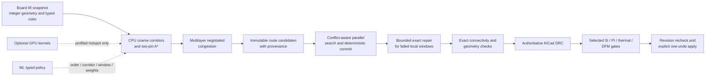

# Modern algorithms and hardware for PCB routing

**Snapshot date:** 2026-08-03

## Recommendation

Build a deterministic CPU-first negotiated-congestion router, then accelerate
only measured bottlenecks. Parallelize routes whose resource footprints do not
conflict, repair stubborn local windows with a bounded exact solver, and let ML
choose typed policy—not copper coordinates. A route is acceptable only after
exact internal checks, authoritative KiCad DRC, and any required physics or DFM
gates.

That order matters. Public PCB evidence supports classical routing more strongly
than end-to-end learned routing, while the largest GPU speedups come from IC
kernels with simpler grids and different rule systems.

## Problem shape

Represent the board as a versioned resource graph whose nodes and edges encode
legal positions, layers, directions, vias, capacities, and costs. A two-pin path
can be solved by a shortest-path search; jointly choosing multi-pin and multi-net
routes is combinatorial. The classical rectilinear Steiner-tree decision problem
is NP-complete ([Garey and Johnson, 1977](https://doi.org/10.1137/0132071)), so a
production router should expect iteration and repair rather than one globally
optimal pass.

The durable algorithmic core remains:

1. Generate legal access points and coarse corridors from exact Board IR.
2. Route a net with maze search or A* using geometry, layer, via, timing, and
   congestion costs. [Lee](https://doi.org/10.1109/TEC.1961.5219222),
   [A*](https://doi.org/10.1109/TSSC.1968.300136), and
   [Soukup](https://doi.org/10.1109/DAC.1978.1585154) remain relevant foundations.
3. Use PathFinder-style negotiated congestion: temporarily allow conflicts,
   increase historical and present costs on overused resources, then rip up and
   reroute until legal or the bounded budget expires
   ([McMurchie and Ebeling, 1995](https://doi.org/10.1145/201310.201328)).
4. Improve only affected nets through an incremental spatial index and bounded
   repair. Never silently weaken clearances or other hard rules to reach 100%.

## Maturity and adoption decisions

| Technique | Evidence maturity | Decision for CopperMCP |
| --- | --- | --- |
| CPU A* or maze routing plus negotiated rip-up and reroute | **Mature.** Long-standing algorithmic basis and direct use in open PCB routers. | Make this the reference implementation and quality baseline. Keep deterministic tie-breaking, budgets, and provenance. |
| Hierarchical global-to-detailed routing and incremental exact DRC | **Mature engineering pattern.** Open IC detailed routers such as [TritonRoute](https://vlsicad.ucsd.edu/Publications/Journals/j133.pdf) demonstrate scalable search and rule checking, while the specific PCB rules still require native implementation. | Use coarse corridors to reduce search, but make detailed geometry and PCB-specific rules authoritative. |
| Conflict-aware multicore routing | **Production-worthy with transfer evidence.** Parallel IC routers show that independent tasks can be batched without corrupting shared state. | Build a conflict graph from candidate resource footprints, search independent batches in parallel, and commit in deterministic order. Requeue conflicts instead of racing writes. |
| Profile-guided Rust hot kernels | **Low-risk systems optimization.** It changes implementation speed, not routing policy. | Keep Python as the reference. Move measured geometry, spatial-index, and search kernels behind versioned contracts only after profiling and equivalence tests. |
| SAT, MIP, or CP local repair | **Promising and bounded.** Exact methods solve specialized windows well but do not scale as the default whole-board engine. | Invoke on small congested windows with strict net, layer, cell, and time bounds. Accept only exact-rule-clean output; otherwise fall back without mutation. |
| GPU wavefront, batched shortest path, congestion maps, or selected DRC kernels | **Promising; mostly IC-transfer evidence.** Kernel speedup can be large, but synchronization, transfers, irregular geometry, and sequential net dependencies reduce end-to-end gains. | Prototype only after a profile identifies a batchable hotspot. Require quality parity, deterministic CPU fallback, and representative RAM/VRAM measurements. |
| Learned net ordering, corridor choice, repair-window selection, or cost weights | **Promising policy layer.** Direct PCB research is limited but supports engine-grounded, constrained actions more than free-form geometry. | Expose a typed proposal interface. Train offline from deterministic traces; constrain outputs; validate every candidate with the same engine and gates. |
| Differentiable placement or learned congestion surrogate | **Promising for proposal generation; mostly IC transfer.** | Use to rank placements or corridors, not to certify legality. Recompute geometry and congestion exactly before routing/apply. |
| Thermal, PDN, or SI surrogates in the inner loop | **Promising accelerator.** Fast approximations can steer search, but dataset domain and error bounds matter. | Use conservative models to rank candidates; run authoritative solvers or rule checks on selected final candidates and critical nets. |
| End-to-end RL, GNN, LLM, or differentiable detailed router emitting final copper | **Speculative and unsafe for the trusted path.** Public PCB scale, constraint coverage, and reproducibility are insufficient. | Do not adopt. Models may propose bounded policy only and never bypass exact geometry, DRC, revision, or apply controls. |
| Custom FPGA/ASIC or mandatory multi-GPU runtime | **Speculative for ordinary PCB workloads.** Hardware specialization precedes evidence of a stable dominant kernel. | Defer. Preserve a portable CPU path and consider specialized hardware only after repeated production profiles justify it. |

## CPU-first execution architecture

### Parallelism contract

Parallel search should not mean parallel mutation of a shared board:

1. Snapshot the board revision and current congestion prices.
2. Estimate each task's coarse resource footprint and build a conflict graph.
3. Search an independent set concurrently against immutable state.
4. Validate candidate geometry locally.
5. Commit in a stable order; reject and requeue any candidate invalidated by an
   earlier commit.
6. Publish only immutable candidate revisions and their seeds, budgets, costs,
   conflicts, and validation results.

This design gains CPU throughput while preserving reproducibility. The approach
is supported by IC-transfer results: [FastGR](https://www.cse.cuhk.edu.hk/~byu/papers/J86-TCAD2023-FastGR.pdf)
reports 2.489× overall and 9.324× kernel speedups without reported quality loss,
and [InstantGR](https://shijulin.github.io/files/1239_Final_Manuscript.pdf) uses
conflict batches and a dependency graph. Those numbers are not PCB performance
claims; they justify measuring the scheduling pattern.

### Bounded exact repair

Exact solvers should receive a small, discretized failure window rather than a
whole board. Variables may choose a candidate path, resource occupancy, layer,
or via; constraints enforce exclusivity and typed rules; the objective minimizes
remaining violations, wire length, vias, and disturbance.

- [MonoSAT's BGA router](https://www.cs.ubc.ca/labs/isd/Projects/monosat/monosat_bga_iccad2016.pdf)
  shows exact solving can handle specialized real BGA instances and sometimes
  prove a minimum layer count, but its reported runs can take thousands of
  seconds. This is direct routing evidence for a narrow package geometry, not a
  general-board solver.
- [SATRoute](https://www.cse.cuhk.edu.hk/~byu/papers/J166-TCAD2026-SATRoute.pdf)
  uses SAT to select causally related nets for detailed-routing repair and reports
  solver time below 4% of total. This is IC-transfer evidence for choosing a
  repair set, not PCB signoff evidence.
- Progressive ILP such as [BoxRouter](https://doi.org/10.1109/TCAD.2007.907003)
  and open solvers such as [OR-Tools CP-SAT](https://github.com/google/or-tools/tree/stable/ortools/sat)
  are implementation options once the local contract is stable.

### GPU adoption gate

A GPU experiment is justified only when all of the following are true:

- a representative profile shows one batchable kernel dominates wall time;
- data can remain resident for enough work to amortize transfer and launch costs;
- the grid or candidate representation fits ordinary target VRAM, not just a
  large accelerator;
- route quality and exact-rule results match the CPU reference;
- CPU fallback remains complete and deterministic; and
- end-to-end wall time, peak host RAM, peak VRAM, energy, and failure behavior are
  measured on real PCB families.

[GAMER](https://doi.org/10.1109/TCAD.2022.3184281) reports about 19.85× GPU-kernel
and 2.7× overall speedup on IC routing contests. GPU DRC research reports highly
rule-dependent gains: [X-Check](https://www.cse.cuhk.edu.hk/~byu/papers/C149-ICCAD2022-GPU-DRC.pdf)
reports only 1.09× for width but roughly 45× for spacing and 61× for enclosure
against multithreaded KLayout. These are useful upper bounds for profiling
priorities, not transferable PCB acceptance results. OrthoRoute's published
memory requirements reinforce the need for a bounded experiment.

## ML and physics safety boundary

The learned interface should return a typed, bounded object such as:

- a stable net-order permutation;
- one of a finite set of legal layer or via strategies;
- coarse corridor masks;
- a bounded repair window and net subset; or
- cost weights within declared ranges.

The deterministic engine converts that policy into candidate copper. Out-of-range
or malformed proposals fail closed, and the system logs model, dataset, feature
schema, seed, confidence, and fallback. A model never writes board geometry or
marks its own result valid.

Direct PCB evidence remains limited. [FanoutNet](https://ojs.aaai.org/index.php/AAAI/article/view/26030)
reports 100% routability and 6.8% average wire-length reduction on five industrial
six-layer fanout cases by combining PPO with a constrained router, but its private
industrial data and narrow fanout scope limit reproducibility. The recent
[PCBWorld](https://arxiv.org/abs/2607.05915) preprint argues for segment-level,
engine-grounded actions over very fine cell actions, yet also reports classical
Freerouting strength on larger boards. Together they support a policy layer, not
unchecked learned geometry.

IC work expands the hypothesis space but must remain labeled transfer evidence:
[DREAMPlace](https://research.nvidia.com/publication/2019-06_dreamplace-deep-learning-toolkit-enabled-gpu-acceleration-modern-vlsi-placement)
demonstrates GPU-accelerated differentiable placement, and
[RoutePlacer](https://arxiv.org/abs/2406.02651) integrates a GNN congestion signal
into differentiable IC placement. Neither proves PCB detailed-routing legality.

For physics, use surrogates as conservative inner-loop costs and authoritative
tools as gates:

- [TRouter](https://www.cse.cuhk.edu.hk/~byu/papers/J94-TCAD2023-TRouter.pdf) is
  direct PCB evidence that a learned thermal predictor can steer routing; it
  reports 0.238 °C prediction error and up to 2.7 °C lower peak temperature on
  academic two- and four-layer cases labeled with HyperLynx.
- A [PDN surrogate](https://arxiv.org/abs/2106.10693) trained on 1.3 million
  synthetic IC examples reports sub-second inference and large solver speedups.
  This is IC-transfer evidence and needs PCB-domain calibration and error bounds.
- A 2025 [PCB power-rail routing method](https://scholars.lib.ntu.edu.tw/entities/publication/c937d895-32fb-4456-9b55-c8d739b1f76c)
  combines mathematical programming with resistance constraints and reports no
  current or voltage violations in its evaluation. It supports typed electrical
  constraints, not replacing signoff.
- Selected critical candidates can be checked with an authoritative solver such
  as [Palace](https://awslabs.github.io/palace/dev/) when a validated adapter and
  material model exist. DRC alone does not establish SI, PI, thermal, EMC, or DFM
  correctness.

## Staged implementation priorities

| Stage | Deliverable | Exit evidence |
| --- | --- | --- |
| 1. Deterministic baseline | Two-pin A*, multilayer vias and keepouts, negotiated-congestion multi-net routing, incremental spatial index, bounded rip-up and reroute | Reproducible candidates; exact connectivity/geometry checks; KiCad DRC; comparison with Freerouting on frozen fixtures |
| 2. CPU scaling | Conflict graph, independent batches, deterministic commit/requeue, profile-guided Rust kernels | Quality parity with the Python reference; measured wall-time and memory gains on the same seeds and boards |
| 3. Exact rescue | SAT/MIP/CP repair over selected failed windows | More legal completions or fewer violations within a hard time/memory budget and without broader-route regressions |
| 4. Optional GPU | One profiled batched search, cost-map, surrogate, or DRC kernel | End-to-end gain after transfers; CPU parity and fallback; representative VRAM fit |
| 5. Learned policy | Offline trace dataset and typed net-order/corridor/window/weight policy | Held-out board-family gains over heuristic policy; no loss in hard correctness; calibrated fallback behavior |
| 6. Physics-aware ranking | Conservative SI/PI/thermal/DFM features and selected authoritative checks | Domain-specific error bounds, traceable tool versions, and final-gate agreement on critical cases |

## Benchmark and acceptance plan

Use several board families; no single public corpus covers the full product
surface:

- [PCBWorld](https://arxiv.org/abs/2607.05915): 679 native KiCad boards and a
  recent learned-versus-classical reference; reproduce before relying on its
  headline numbers.
- [PCBench](https://61dac.conference-program.com/presentation/?id=RESEARCH617&sess=sess237):
  community PCB layouts and a larger placement corpus; confirm artifact license,
  availability, and exact split before redistribution.
- [PCBBenchmarks](https://github.com/aspdac-submission-pcb-layout/PCBBenchmarks):
  a small open research set useful for smoke tests, not statistical conclusions.
- [tscircuit autorouter](https://github.com/tscircuit/tscircuit-autorouter): seeded
  synthetic cases useful for controlled congestion scaling and visualization.
- Internal, redistributable KiCad fixtures: differential pairs, BGA escape,
  planes, keepouts, regional rules, blind/buried-via cases, dense mixed-signal,
  and intentionally impossible boards.

Record dataset source and license, immutable split, board revision, exporter and
importer, rule manifest, algorithm configuration, seed, CPU/GPU and memory,
compiler/runtime versions, and artifacts for every run. Never delete failed or
timed-out cases.

Acceptance has separate gates:

- **Hard correctness:** connectivity, shorts, clearances, geometry validity,
  permitted layers/vias, no silent rule relaxation, and authoritative KiCad DRC.
- **Constraint quality:** routed-net fraction, differential-pair and length/skew
  compliance, critical-net rules, and selected SI/PI/thermal/DFM results.
- **Geometric quality:** wire length, via count, layer changes, congestion,
  disturbance, and cleanup burden.
- **Systems quality:** end-to-end wall time, p50/p95 case time, peak RAM/VRAM,
  deterministic replay, cancellation, timeout, and CPU fallback.
- **Generalization:** freeze train/validation/test by board family, not random
  segments from the same board; compare every learned policy with the deterministic
  heuristic it replaces.

IC ISPD contest cases may stress a search or GPU kernel, but passing them must
never be reported as evidence of PCB DRC, SI/PI, DFM, or KiCad compatibility.
